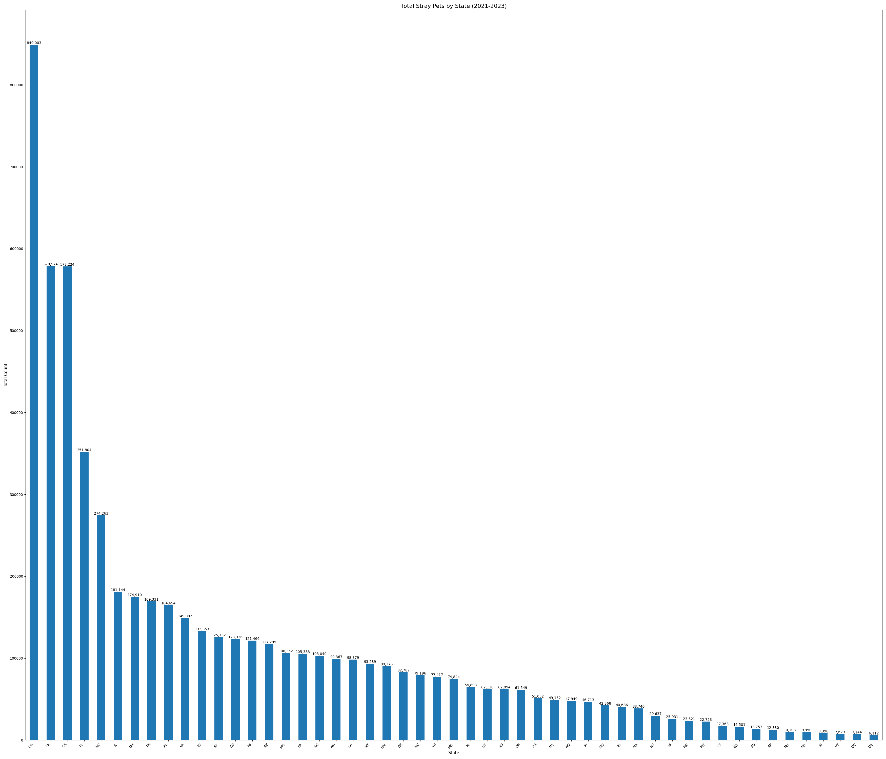
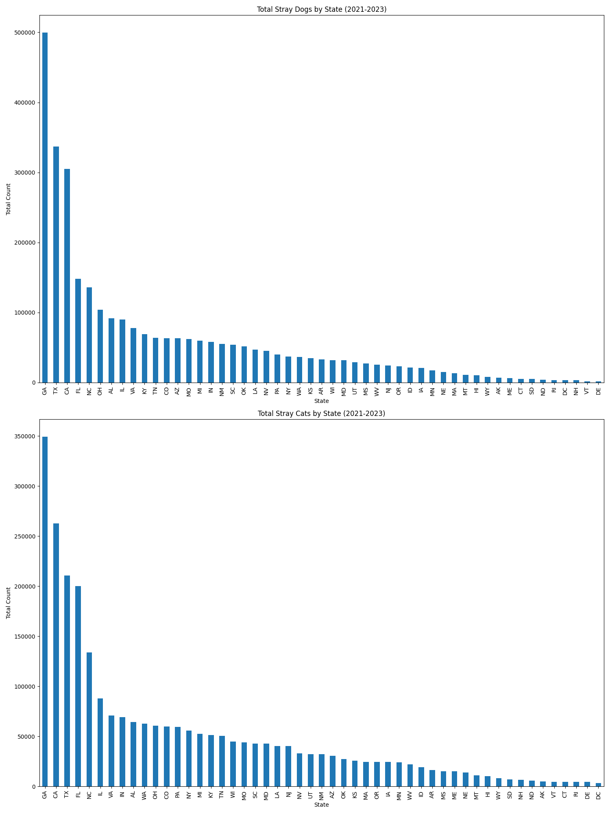
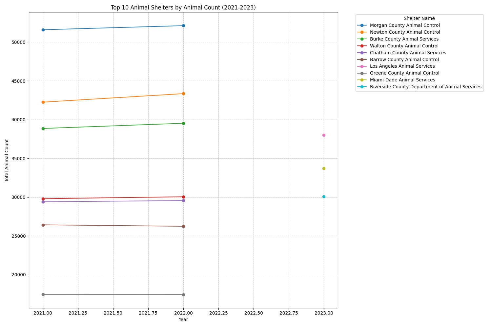
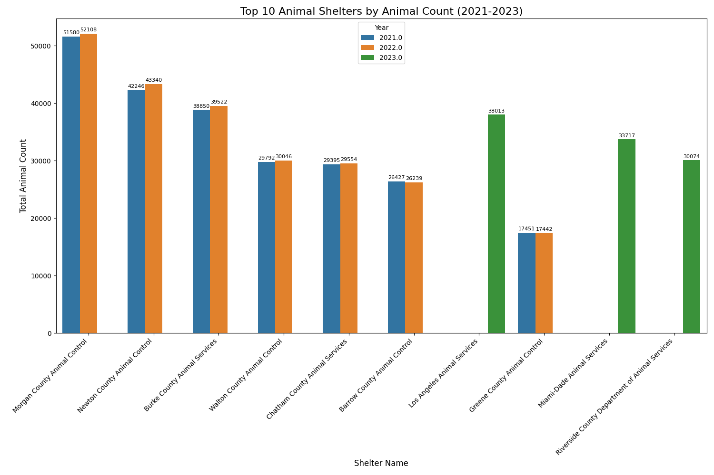
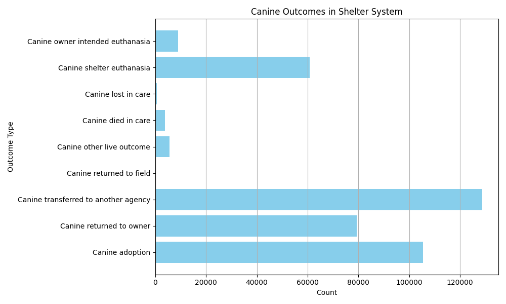
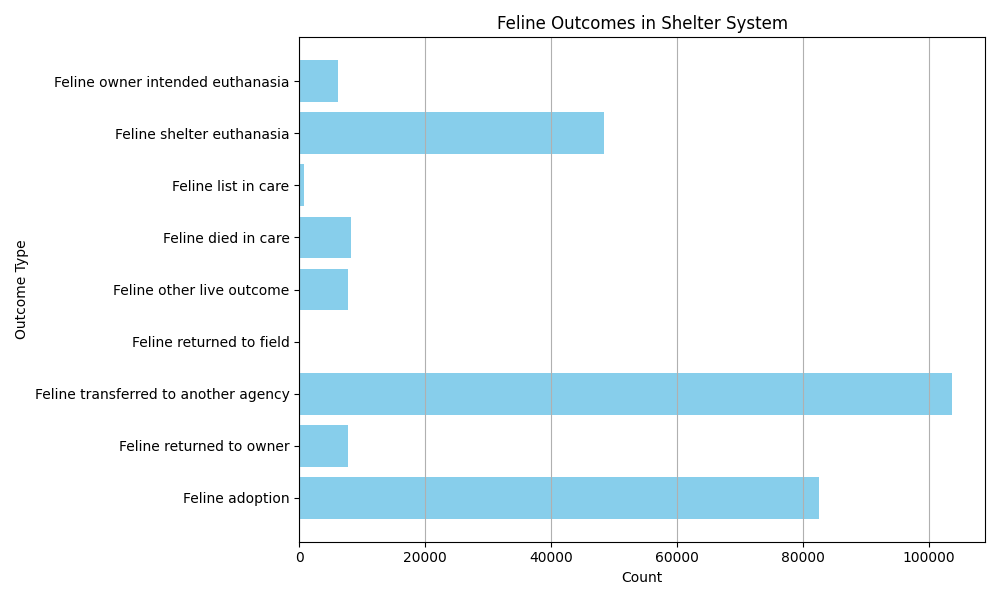
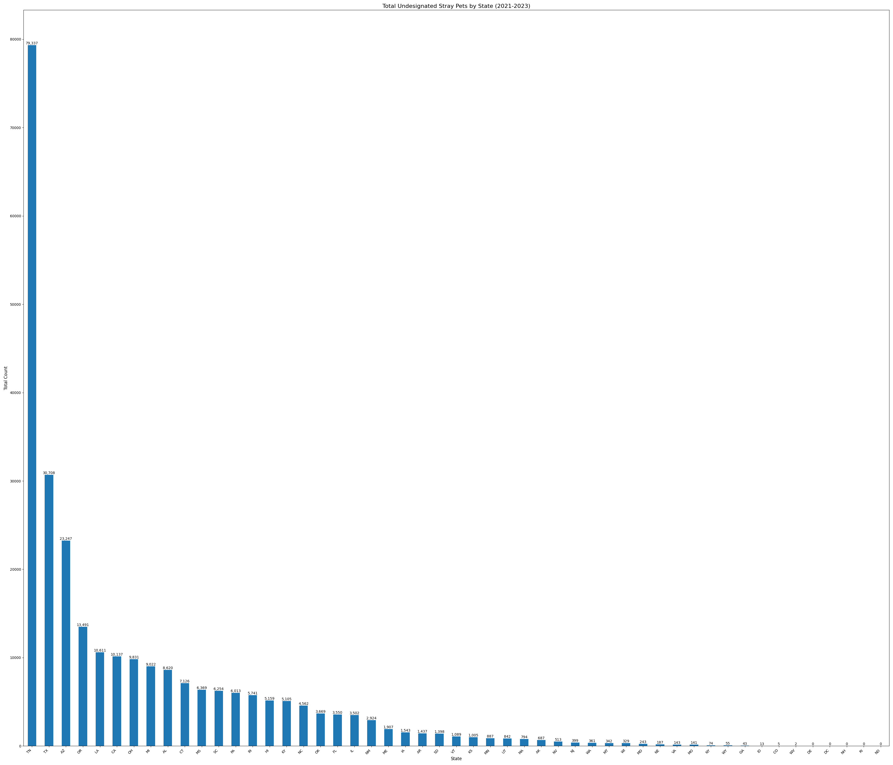

# Dataset-Final-Project

## Description of Problem

The objective of this project is to understand, in a nutshell, how stray pets are taken into the animal shelter system, how they are processed, and what are their outcomes. Answering these questions are important because understanding the distribution and features of stray pet populations can help in developing targeted interventions to manage these animal populations more compassionately, therefore improving the quality of their lives. Better animal management may also lead to more favorable public health outcomes for human populations as well. This project was influenced by my parents, who struggled with understanding options for petcare as they grew older. 

## Previous Datasets
Animal Shelter Reporting is very regional and non standardized. Most of the data is on cats and dogs. While our exploratory data analysis focuses on these animal types, this dataset has been constructed as a compedium of information and is intended to become a composite representation of the animal shelter system in the United States.


## Description of Dataset

This dataset contains almost 12000 entries and is taken from 48 of the 50 states within North America.

A brief description of the Intake and Outake Categories:

1. Stray/at large: Stated to be unowned or free-roaming.
2. Relinquished by owner: Admitted by owner, including adoption returns. All returns should be tracked as owner relinquishment.
3. Owner Intended euthanasia: Limited to this definition: Admission of pets whose owner brought the pet to the shelter with the INTENT of requesting euthanasia.
4. Transferred in from agency: An admission from another agency, for adoption, large scale seizure support, etc.
5. Other intakes: Impounds for cruelty cases & protective custody. Also, pets born while in care, and other types of admission not captured above.

1. Adoption: Final adoptions only, having permanently left the agency's possession. This does NOT include animals placed in foster care or on overnight 'trial' stays.
2. Returned to owner: Stray or Owner Relinquished animals returned to their owner.
3. Transferred to another agency: Transferred out of the agency's possession to another entity.
4. Returned to field: Animals included in intake, altered and returned to stray capture location to be released. This is not allowed in Georgia.
5. Other live outcome: Barn cat programs, etc.
6. Died in care: Animals who die, unassisted, while sheltered.
7. Lost in care: Animals whose outcome is unknown (may have escaped the shelter, outcome was not recorded and unknown).
8. Shelter euthanasia: All euthanasia other than that performed by the definition below as owner-intended euthanasia.
9. Owner-intended euthanasia: Limited to this definition: Euthanasia of pets whose owner brought the pet to the shelter with the INTENT of utilizing euthanasia services.

A couple more definitions:

1) Gross intake includes all intake, while net intake excludes transfers in (from other shelters and rescues).

2) Best Friends doe not have detailed species data for all shelter, some shelters don’t provide a breakdown of cats and dogs. And some might provide the breakdown for intake but not for outcomes. As a result, there will be a column labeled “undesignated species”—that’s where such data is captured. Although some shelters do bring in animals other than cats and dogs, the “undesignated species” data should include only cats and dogs.


## Data Collection Protocol
1) [Google Form](https://docs.google.com/forms/d/1azUP8nTF4AuQ3BTnX7rMH-eW--G5HWqQp6du80_gKwM/edit)
A pilot survey was conducted through various local animal shelters and their data was manually annotated and checked for duplicated information. The quality of data received through this method was often times inconsistent and incomplete. 

2) [Government of Georgia Shelter Data Reporting](https://agr.georgia.gov/government-shelter-data-reporting)

Publicly available online information was included in the dataset from the State of Georgia Animal Shelter Database. The State of Georgia requires its state-own shelters to submit several basic KPI monthly. The dataset and its related information can be found in the associated link to this subsection. 


3) Public Access Request Data Sharing (Best Friends Animal Society) 
A public access request was made to the Best Friends Animal Society and a Data Sharing Agreement needed to be signed on my behalf. In addition to the above categories, 


## Statistical Power Analysis
Background: Cats live on average three years longer than dogs. (Source)

- Null Hypothesis (H0): There is no difference between the number of stray cats versus dogs in the American shelter system.

- Alternate Hypothesis: There is a statistical difference between the number of stray cats currently held in the American shelter system versus dogs.  

Effect size: 0.2 (Cohen’s d recommendation - conservative)
Significance level (α): .01
Power(1-β): 0.80
Num tests: 1

Note: A conservative effect size and significance level was used to start the analysis to determine sample size. In addition, at this time Bonferroni correction will not be applied. Multiple hypotheses testing was not considered after exploratory testing of the dataset. In python, TTestIndPower using two-sided t test was used to calculate the following rounded sample size: 586 Samples    


## Exploratory Data Analysis

    # Figure 1 Total Intake of All Animals By State

This figure shows the total intake of animals from the years 2021-2023, regardless of animal type segregated by the State where they were collected. The plot is arranged in descending order. The data shows the largest number of animals were taken in the states of Georgia, Texas, and California. While Texas and California seem to make sense as they are large states, the inclusion of Georgia as the leader in animal counts appears to be skewed by the representation of the data. Some states, like Georgia, have more standardized collection practices than other states, and this fact is borne by this result. The limitation of non uniform data collection will be discussed further in the Limitation section. The data shows almost 3 million pets taken into shelter system over a 3 year period.    

    # Figure 2 Examining Total Intakes by Animal Type Segregated by State 

These complementary figures (Figures 2a & 2b) shows the total intake of animals from the years 2021-2023 differentiated by animal type, and once again segregated by the State where they were collected. The plot is arranged in descending order. The same three states, Texas, California, and Georgia are the top intake states for both animal types. The number of Dogs taken into shelters appear to be higher overall than the number of cats.

    # Figure 3 Examining Net Intakes by Dog Animal Type Segregated by State

These complementary figures (Figures 3a & 3b) shows the net intake of animals from the years 2021-2023 differentiated by animal type, and once again segregated by the State where they were collected. The plot is arranged in descending order. The data shows the largest number of animals were taken in the states of Georgia, Texas, and California for both cats and dogs. The same three states, Texas, California, and Georgia are the top intake states for both animal types and this is in line with the previous figures.

    # Figure 4 Top 10 Shelters by Animal Count 

Figure 4 shows total animal counts over the period from 2021-2023 broken down to the individual shelters with the top 10 shelters displayed by name. There is a gap in the figure due to missing reported data, which will be discussed further in the limitation section.   

    # Figure 5 Top 10 Shelters by Animal Count Separated by Year

Figure 5 shows a different view of total animal counts over the period from 2021-2023 broken down by year to the individual shelters with the top 10 shelters displayed by name. The data better illustrates the relative consistency between the top shelters, in terms of the animals taken in on a yearly basis. 
    # Figure 6 Understanding Canine Health Outcomes in the State of Georgia

Figure 6 shows Canine Outcomes in the State of Georgia between 2021 to 2023. Fortunately, the majority are either transferred or adopted. Canines lost in Care or returned to the field appear to be non common events.
     
    # Figure 7 Understanding Female Health Outcomes in the State of Georgia

Figure 7 shows Feline Outcomes in the State of Georgia between 2021 to 2023. Fortunately, the majority are either transferred or adopted. Canines lost in Care or returned to the field appear to be non common events. Fewer cats were euthanized during this period versus dogs.

    # Figure 8 Examining Undesignated Species Total Intakes by State

Figure 8 shows the total gross count of undesignated species segregated by state between the years 2021 to 2023. This graphic shows the highest reported totals for undesignated species to be in Tennessee.

## Limitations of this study
The reporting of intake data and outcomes is non standardized across sources. For examples, some shelters differentiate between species, others do not. Furthermore, there are no national guidelines about when the data needs to be collected, and how/when it should be reported. 

There are gaps in reporting from shelter sources. Some of these entries are manually entered, and are prone to typos. 

There are no national guidelines for collecting and publishing outcome data, and this information has been hard to come by.


## Instructions to Run the Scripts


To set up the development environment: 

For Windows:

1) Activate Virtual Environment
   ```
   python  -m venv 
   .venv .venv/Scripts/activate 
   ```
    
2) Install the requirements.txt file

    ``` 
    python -m pip install -r requirements.txt 
    ```

3) Execute the unit tests
    ```
    pytest
    ```

4) Execute dataset_transformation
    ``` 
    python dataset_transformation.py 
    ```
5) Execute Statistical Power Analysis
    ``` 
    statistical_power_analysis.py 
    ```

## Ethics Statement

This research project on stray pet populations in U.S. animal shelters is committed to upholding high ethical standards in data collection, analysis, distribution and dissemination. Sensitivity and consideration must be applied when working with data related to vulnerable animal populations. Therefore, this study is committed to the following ethical principles:

1) Animal Welfare: While this study does not directly involve animal experimentation, the data represents real animals in shelters. The data will be handled respectfully, recognizing that each data point represents a sentient being. This study shall NOT be used to to further the exploitation, harming, or attempting to exploit animals or individuals in any way by exposing them to inappropriate content, asking for personally identifiable information, or otherwise. 

2) Data Privacy and Confidentiality: All data collected from animal shelters will be anonymized to protect the privacy of individual shelters, their staff, and the animals. No personally identifiable information will be included in the dataset.

3) Informed Consent: Informed consent will be requested, where applicable, from participating animal shelters before collecting any data. Shelters will be fully informed about the purpose of the study, how their data will be used, and their right to withdraw participation at any time.

4) Data Accuracy and Integrity:  maintaining the highest standards of data accuracy and integrity throughout the research process. Any data inconsistencies or limitations will be transparently reported.

4) Responsible Use of Data: The collected data will be used solely for the stated research purposes. We will not use the data in any way that could potentially harm or stigmatize animal shelters or stray animal populations. The data or outcomes of this study is not intended for commercial use. 

5) Transparency: Research methods, data sources, and any limitations of the study will be communicated in a transparent fashion. The final dataset and research findings will be made available to participating shelters and the wider research community, as open source, following all applicable laws.

6) Beneficence: This research aims to benefit stray animal populations by providing insights that could inform better management and care practices. This study is intended to ensure that any applicable research outcomes contribute positively to animal welfare efforts.

7) Non-Maleficence: The anonymization of data is performed to avoid any unintended negative consequences of our research, such as misrepresentation of data that could negatively impact shelter operations or public perceptions of stray animals.

8) Respect for Diversity: Animal Shelters face diverse contexts and challenges across different regions. This analysis will take into account these variations, avoid overgeneralization, and highlight limitations from the outlined study.

By adhering to these ethical principles, we aim to conduct research that is not only scientifically rigorous but also ethically sound and beneficial to the future welfare of stray animals, shelters, and interested stakeholders.

# Kaggle
https://www.kaggle.com/datasets/santoshganesan/aggregated-shelter-data/data

# License Information

This dataset is distributed by [CC BY-NC-SA 4.0](https://creativecommons.org/licenses/by-nc-sa/4.0/)

A copy can be found at LICENSE.txt

# Acknowledgement.

I would like to acknowledge Kaggle user [bachkhoa144](https://www.kaggle.com/code/bachkhoa144/georgia-animal-shelter-eda-time-series-forecast) from whom I sourced some of the data analysis. Their notebook is licensed under APACHE 2.0. A copy of the license can be found at LICENSE_APACHE_2.0.txt.

I would like to acknowledge Best Friends Animal Society for sharing their propietery shelter information for the use in this dataset project. 